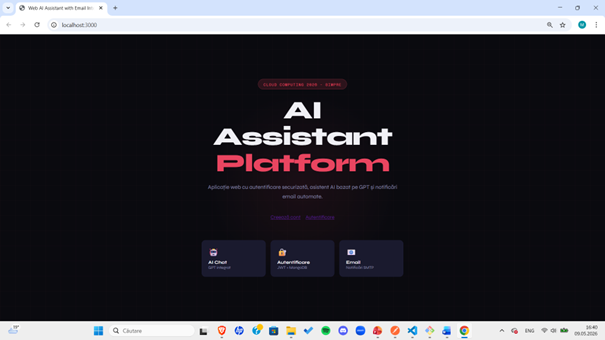
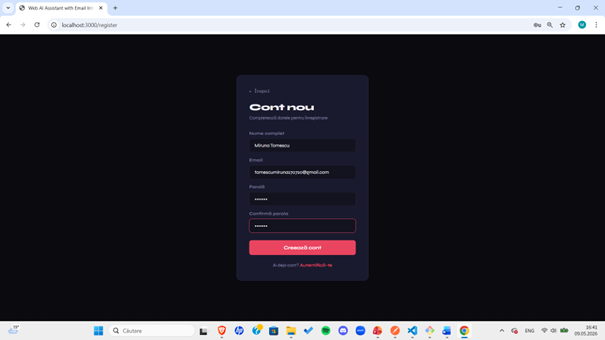
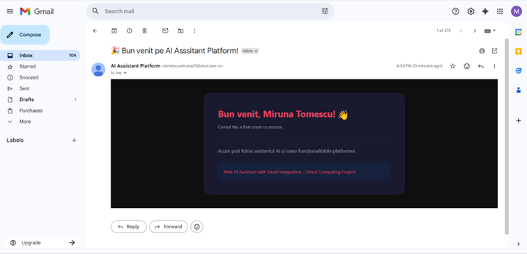
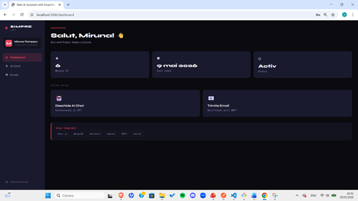
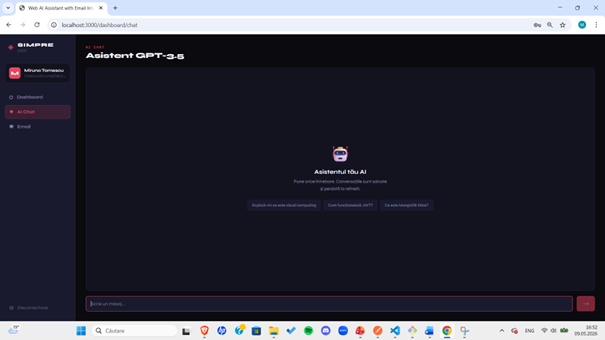
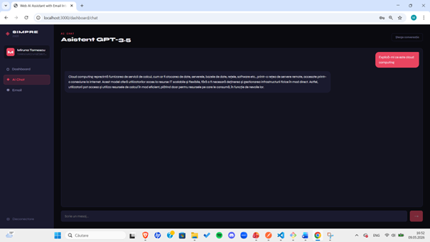
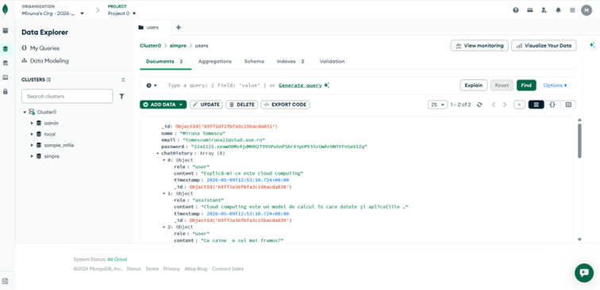
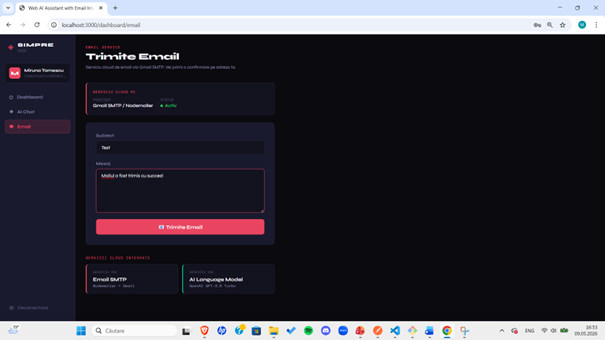
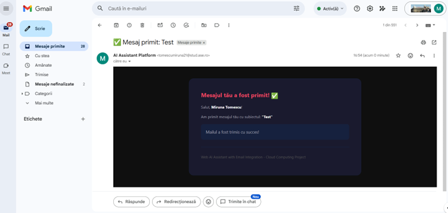

# Web AI Assistant with Email Integration

**Nume:** Tomescu Miruna  
**Grupa:** 1047

---
🌐 **Link repository GitHub:** https://github.com/mirunatomescu/cloud-computing-project
🎥 **Video prezentare YouTube:** https://youtu.be/ux1axXt8jtU?si=gC6EFarSGsR_6W-C  
🌐 **Link publicare Vercel:** https://cloud-computing-project-seven.vercel.app/

---

## 📋 Cuprins

1. [Introducere](#1-introducere)
2. [Descriere problemă](#2-descriere-problemă)
3. [Descriere API](#3-descriere-api)
4. [Flux de date](#4-flux-de-date)
5. [Capturi ecran aplicație](#5-capturi-ecran-aplicație)
6. [Referințe](#6-referințe)
7. [Tehnologii folosite](#7-tehnologii-folosite)
8. [Arhitectura aplicației](#8-arhitectura-aplicației)
9. [Instrucțiuni de instalare](#9-instrucțiuni-de-instalare)
10. [Configurare variabile de mediu](#10-configurare-variabile-de-mediu)
11. [Rulare locală](#11-rulare-locală)
12. [Deploy pe Vercel](#12-deploy-pe-vercel)
13. [Structura proiectului](#13-structura-proiectului)

---

## 1. Introducere

**Web AI Assistant with Email Integration** este o aplicație web full-stack creată pentru materia Cloud Computing, care demonstrează integrarea a **trei servicii cloud**:

- ☁️ **Serviciu Cloud #1 - OpenAI GPT-3.5** (REST API) - asistent AI conversațional cu memorie persistentă, accesat prin API REST oficial
- ☁️ **Serviciu Cloud #2 - Gmail SMTP prin Nodemailer** (serviciu email cloud) - notificări automate la înregistrare și la trimiterea mesajelor
- ☁️ **Serviciu Cloud #3 - MongoDB Atlas** (Database-as-a-Service) - stocare persistentă pentru utilizatori, sesiuni și istoricul conversațiilor AI

Utilizatorul se poate înregistra, autentifica și accesa un dashboard personal de unde poate conversa cu asistentul AI și trimite email-uri de confirmare. Autentificarea este persistentă prin JWT - utilizatorul rămâne logat chiar și după refresh sau închiderea browser-ului. Aplicația este publicată pe **Vercel**.

---

## 2. Descriere problemă

Aplicația rezolvă nevoia de a integra într-un singur loc mai multe servicii cloud distincte, conectate printr-un API REST intern:

1. **Comunicare AI** - utilizatorul poate pune întrebări unui asistent bazat pe GPT-3.5, care răspunde în timp real. Fiecare conversație este salvată automat în MongoDB Atlas, astfel că istoricul este disponibil la orice reconectare.

2. **Notificări prin email** - la înregistrare, utilizatorul primește automat un email de bun venit prin Gmail SMTP. De asemenea, poate trimite manual email-uri de test prin interfața platformei, primind imediat o confirmare în căsuța proprie.

3. **Persistența datelor în cloud** - toți utilizatorii, parolele (stocate hash-uite cu bcrypt), sesiunile și istoricul conversațiilor sunt stocate în MongoDB Atlas (Free Tier M0), un serviciu cloud de tip Database-as-a-Service, accesibil din orice regiune.

Problema centrală este **autentificarea persistentă la refresh**: utilizatorul rămâne logat datorită sesiunilor JWT gestionate de NextAuth.js cu o durată de 30 de zile, fără a fi necesară re-autentificarea.

---

## 3. Descriere API

Aplicația expune un API REST intern prin **Next.js API Routes**. Toate endpoint-urile care manipulează date private necesită autentificare activă (sesiune JWT validă verificată server-side).

### Endpoint-uri disponibile

| Metodă | Endpoint | Autentificare | Descriere |
|--------|----------|:---:|-----------|
| `POST` | `/api/auth/register` | ❌ | Înregistrare utilizator nou + email bun venit automat |
| `POST` | `/api/auth/signin` | ❌ | Autentificare (gestionat de NextAuth) |
| `GET` | `/api/auth/session` | ❌ | Returnează sesiunea curentă |
| `GET` | `/api/chat` | ✅ | Returnează istoricul conversațiilor utilizatorului din MongoDB |
| `POST` | `/api/chat` | ✅ | Trimite un mesaj la OpenAI GPT-3.5 (REST API) și salvează răspunsul în MongoDB |
| `POST` | `/api/contact` | ✅ | Trimite email de confirmare via Gmail SMTP |
| `GET` | `/api/user` | ✅ | Returnează profilul utilizatorului autentificat din MongoDB |

### Autentificare și autorizare

Autentificarea este gestionată de **NextAuth.js v4** cu strategie **CredentialsProvider** (email + parolă). La login, NextAuth creează un token JWT semnat cu `NEXTAUTH_SECRET`, stocat în cookie `HttpOnly`. La fiecare request către un endpoint protejat, serverul verifică sesiunea prin `getServerSession(authOptions)`.

Parolele sunt stocate hash-uite cu **bcryptjs** (salt rounds: 12). Nicio parolă în clar nu ajunge în baza de date sau în log-uri.

### Autentificare la serviciile cloud externe

**☁️ Serviciu Cloud #1 - OpenAI GPT-3.5 (REST API)**
- Comunicare prin **HTTP REST** la `https://api.openai.com/v1/chat/completions`
- Autentificare prin header: `Authorization: Bearer <OPENAI_API_KEY>`
- Gestionat prin SDK-ul oficial `openai` (wrapper peste REST API)
- Model utilizat: `gpt-3.5-turbo`, `max_tokens: 1000`, `temperature: 0.7`

**☁️ Serviciu Cloud #2 - Gmail SMTP (Nodemailer)**
- Comunicare prin protocolul **SMTP** cu serverele Google (`smtp.gmail.com:587`)
- Autentificare prin **Gmail App Password** (generat separat, nu parola contului Google)
- Gestionat prin librăria `nodemailer` cu `service: 'gmail'`
- Utilizat în două locuri: email de bun venit la înregistrare și email de confirmare din dashboard

**☁️ Serviciu Cloud #3 - MongoDB Atlas (Database-as-a-Service)**
- Comunicare prin **protocolul MongoDB** (TCP/IP) via driverul `mongoose`
- Autentificare prin connection string: `mongodb+srv://<user>:<password>@cluster0.xxxxx.mongodb.net/`
- Conexiunea este cached la nivel de modul Node.js pentru a evita reconectările inutile în mediul serverless Vercel
- Colecție utilizată: `users` - stochează profilul, parola hash-uită și array-ul `chatHistory`

---

## 4. Flux de date

```
Utilizator (Browser)
        │
        │  1. POST /api/auth/register
        │     { name, email, password }
        │     ├──────────────────────────────────────────► MongoDB Atlas (Cloud #3)
        │     │                                             Salvează utilizator nou
        │     └──────────────────────────────────────────► Gmail SMTP (Cloud #2)
        │                                                   Trimite email bun venit
        │
        │  2. POST /api/auth/signin
        │     { email, password }
        │     ├──────────────────────────────────────────► MongoDB Atlas (Cloud #3)
        │     │                                             Verifică credențiale
        │     ◄── JWT token (cookie HttpOnly, 30 zile)
        │
        │  3. POST /api/chat
        │     { message, history }
        │     ├──────────────────────────────────────────► OpenAI REST API (Cloud #1)
        │     │                                             POST /v1/chat/completions
        │     │                                             ◄── { reply, tokens }
        │     └──────────────────────────────────────────► MongoDB Atlas (Cloud #3)
        │                                                   Salvează mesaj + răspuns
        │
        │  4. POST /api/contact
        │     { subject, messageBody }
        │     └──────────────────────────────────────────► Gmail SMTP (Cloud #2)
        │                                                   Trimite email confirmare
        ▼
   Vercel (Next.js 14 - App Router)
        │
        ├── ☁️ OpenAI GPT-3.5  ── REST API (HTTPS)
        ├── ☁️ Gmail SMTP       ── Protocol SMTP
        └── ☁️ MongoDB Atlas    ── Driver Mongoose (TCP)
```

### Exemple de request / response

**POST `/api/chat`** - trimite mesaj la OpenAI GPT-3.5

Request:
```json
{
  "message": "Explică-mi ce este cloud computing",
  "history": []
}
```

Response:
```json
{
  "message": "Cloud computing este un model de calcul în care datele și aplicațiile sunt stocate și procesate pe servere la distanță...",
  "tokens": 187
}
```

---

**POST `/api/auth/register`** - înregistrare utilizator nou

Request:
```json
{
  "name": "Miruna Tomescu",
  "email": "tomescumiruna21@stud.ase.ro",
  "password": "parola123"
}
```

Response (succes):
```json
{
  "message": "Cont creat cu succes! Verifică emailul."
}
```

Response (eroare - email deja folosit):
```json
{
  "error": "Există deja un cont cu acest email"
}
```

---

**POST `/api/contact`** - trimitere email de confirmare

Request:
```json
{
  "subject": "Test",
  "messageBody": "Mailul a fost trimis cu succes!"
}
```

Response:
```json
{
  "message": "Email trimis cu succes!"
}
```

### Metode HTTP utilizate

- **GET** - preluare date (istoric chat din MongoDB, profil utilizator, sesiune curentă)
- **POST** - creare date noi (mesaj chat trimis la OpenAI, înregistrare utilizator, trimitere email SMTP)

---

## 5. Capturi ecran aplicație

### Landing Page - `app/page.tsx`

Pagina principală a platformei, cu descrierea celor trei servicii cloud integrate și butoane de navigare spre înregistrare și autentificare.



---

### Pagina de înregistrare - `app/register/page.tsx`

Formularul de creare cont nou. La submit, parola este hash-uită cu bcrypt, contul este salvat în MongoDB Atlas (Cloud #3), și se trimite automat un email de bun venit prin Gmail SMTP (Cloud #2).



---

### Email de bun venit - Cloud #2 (Gmail SMTP) - `app/api/auth/register/route.ts`

Email-ul primit automat în căsuța Gmail imediat după crearea contului, generat cu un template HTML și trimis prin Nodemailer conectat la Gmail SMTP.



---

### Dashboard Overview - `app/dashboard/page.tsx`

Pagina principală a dashboard-ului, accesibilă doar utilizatorilor autentificați. Afișează numărul de mesaje AI salvate în MongoDB Atlas, data creării contului și acțiuni rapide spre cele două servicii cloud.



---

### AI Chat - pagina inițială - `app/dashboard/chat/page.tsx`

Interfața de chat cu asistentul GPT-3.5 (Cloud #1 - OpenAI), înainte de a fi trimis primul mesaj. Include sugestii de întrebări predefinite.



---

### AI Chat - conversație activă - Cloud #1 (OpenAI GPT-3.5) - `app/dashboard/chat/page.tsx`

Răspuns generat de OpenAI GPT-3.5 la întrebarea „Explică-mi ce este cloud computing". Mesajul și răspunsul sunt salvate imediat în MongoDB Atlas (Cloud #3).



---

### MongoDB Atlas Data Explorer - Cloud #3 (Database-as-a-Service)

Vizualizarea documentelor din colecția `users` în consola MongoDB Atlas. Se poate observa structura documentului: câmpurile utilizatorului, parola hash-uită cu bcrypt și array-ul `chatHistory` cu mesajele din conversațiile AI salvate automat.



---

### Pagina Email - `app/dashboard/email/page.tsx`

Formularul de trimitere email manual prin Cloud #2 (Gmail SMTP). Utilizatorul introduce un subiect și un mesaj; emailul este trimis la adresa asociată contului prin Nodemailer.



---

### Email de confirmare primit - Cloud #2 (Gmail SMTP) - `app/api/contact/route.ts`

Email-ul de confirmare primit în Gmail după trimiterea unui mesaj din dashboard, generat cu template HTML personalizat și livrat prin Gmail SMTP.



---

## 6. Referințe

- [Next.js Documentation](https://nextjs.org/docs) - framework-ul aplicației (App Router, API Routes)
- [NextAuth.js Documentation](https://next-auth.js.org/) - autentificare JWT persistentă
- [OpenAI API Reference](https://platform.openai.com/docs/api-reference) - GPT-3.5-turbo REST API
- [Nodemailer Documentation](https://nodemailer.com/about/) - serviciu SMTP pentru email
- [MongoDB Atlas](https://www.mongodb.com/atlas) - baza de date cloud (Database-as-a-Service)
- [Mongoose Documentation](https://mongoosejs.com/docs/) - ODM pentru MongoDB
- [Vercel Platform](https://vercel.com/docs) - hosting și deployment serverless
- [bcryptjs](https://www.npmjs.com/package/bcryptjs) - hash parole

---

## 7. Tehnologii folosite

### Frontend
| Tehnologie | Versiune | Scop |
|---|---|---|
| **Next.js** | 14.2 | Framework React full-stack cu App Router |
| **TypeScript** | 5.x | Tipare statice pentru siguranță cod |
| **React** | 18.x | Biblioteca UI |

### Backend / API
| Tehnologie | Versiune | Scop |
|---|---|---|
| **Next.js API Routes** | 14.2 | Endpoint-uri REST server-side |
| **NextAuth.js** | 4.x | Autentificare JWT + sesiuni persistente |
| **bcryptjs** | 2.4 | Hash parole |

### Servicii Cloud

#### ☁️ Serviciu Cloud #1 - OpenAI GPT-3.5 (REST API)
- **Provider**: OpenAI Platform
- **Library**: `openai` (SDK oficial)
- **Model**: `gpt-3.5-turbo`
- **Utilizare**: Asistent AI conversațional cu memorie

#### ☁️ Serviciu Cloud #2 - Email SMTP (Nodemailer + Gmail)
- **Provider**: Google Gmail cu App Passwords
- **Library**: `nodemailer`
- **Utilizare**: Email de bun venit la înregistrare + confirmare mesaje

#### ☁️ Serviciu Cloud #3 - MongoDB Atlas (Database-as-a-Service)
- **Provider**: MongoDB Atlas (Free Tier M0)
- **Library**: `mongoose`
- **Utilizare**: Utilizatori, sesiuni, istoric conversații

### Deployment
| Platformă | Scop |
|---|---|
| **Vercel** | Hosting aplicație Next.js (gratuit) |
| **MongoDB Atlas** | Bază de date cloud (Free Tier) |
| **GitHub** | Cod sursă + CI/CD automat cu Vercel |

---

## 8. Arhitectura aplicației

```
Browser (Client)
        │
        ▼
   Next.js App (Vercel)
   ┌─────────────────────┐
   │  /app               │
   │  ├── page.tsx       │  ← Landing page
   │  ├── login/         │  ← Autentificare
   │  ├── register/      │  ← Înregistrare
   │  └── dashboard/     │  ← Zona protejată
   │      ├── page.tsx   │  ← Overview
   │      ├── chat/      │  ← AI Chat
   │      └── email/     │  ← Trimitere email
   │                     │
   │  /api               │
   │  ├── auth/          │  ← NextAuth + Register
   │  ├── chat/          │  ← OpenAI integration
   │  ├── contact/       │  ← Email service
   │  └── user/          │  ← Profil utilizator
   └─────────────────────┘
        │         │
        ▼         ▼
   OpenAI     Gmail SMTP
   GPT-3.5    (Nodemailer)
        │
        ▼
   MongoDB Atlas
   (Users + ChatHistory)
```

---

## 9. Instrucțiuni de instalare

### Prerechizite
- Node.js 18+ ([descarcă](https://nodejs.org/en/download/))
- Git ([descarcă](https://git-scm.com/downloads))
- Cont MongoDB Atlas ([creare](https://account.mongodb.com/account/login))
- Cont OpenAI ([creare](https://platform.openai.com/login))
- Gmail cu App Passwords activat

### Clonare repository

```bash
git clone https://github.com/mirunatomescu/simpre-2026.git
cd simpre-2026
npm install --legacy-peer-deps
```

---

## 10. Configurare variabile de mediu

Creează un fișier `.env.local` în rădăcina proiectului și completează:

```env
# MongoDB Atlas
MONGODB_URI=mongodb+srv://<user>:<password>@cluster0.xxxxx.mongodb.net/simpre2026

# NextAuth
NEXTAUTH_SECRET=string_random_minim_32_caractere
NEXTAUTH_URL=http://localhost:3000

# OpenAI
OPENAI_API_KEY=sk-proj-...

# Gmail SMTP
EMAIL_USER=adresa_ta@gmail.com
EMAIL_PASS=parola_aplicatie_16_caractere
```

### Cum obții fiecare cheie

**MongoDB URI:**
1. Loghează-te pe [cloud.mongodb.com](https://cloud.mongodb.com)
2. Cluster → Connect → Drivers → copiază URI-ul

**NextAuth Secret:**
```bash
openssl rand -base64 32
```

**OpenAI API Key:**
1. Accesează [platform.openai.com/api-keys](https://platform.openai.com/api-keys)
2. Create new secret key

**Gmail App Password:**
1. [myaccount.google.com](https://myaccount.google.com) → Security
2. Activează 2-Step Verification
3. App passwords → Mail → Other → copiază parola de 16 caractere

---

## 11. Rulare locală

```bash
npm run dev
```

Aplicația rulează pe [http://localhost:3000](http://localhost:3000).

**Flux de testare:**
1. Accesează `http://localhost:3000`
2. Creează un cont nou (`/register`)
3. Verifică emailul de bun venit în căsuța ta Gmail
4. Autentifică-te (`/login`)
5. Testează AI Chat (`/dashboard/chat`)
6. Trimite un email de test (`/dashboard/email`)
7. Dă refresh - sesiunea persistă

---

## 12. Deploy pe Vercel

1. Push cod pe GitHub:
```bash
git init
git add .
git commit -m "Initial commit"
git remote add origin https://github.com/mirunatomescu/simpre-2026.git
git push -u origin main
```

2. Accesează [vercel.com](https://vercel.com) → New Project
3. Importă repository-ul de pe GitHub
4. Adaugă variabilele de mediu din `.env.local` în **Vercel Dashboard → Settings → Environment Variables**
5. Deploy!
---

## 13. Structura proiectului

```
simpre-2026/
├── app/
│   ├── api/
│   │   ├── auth/
│   │   │   ├── [...nextauth]/route.ts   # NextAuth config + JWT
│   │   │   └── register/route.ts        # Înregistrare + email bun venit
│   │   ├── chat/route.ts                # OpenAI GPT integration (Cloud #1)
│   │   ├── contact/route.ts             # Email SMTP service (Cloud #2)
│   │   └── user/route.ts                # Profil utilizator
│   ├── components/
│   │   └── SessionProvider.tsx          # NextAuth provider
│   ├── dashboard/
│   │   ├── chat/page.tsx               # Pagina AI Chat
│   │   ├── email/page.tsx              # Pagina Email
│   │   ├── DashboardClient.tsx         # Sidebar + navigare
│   │   ├── layout.tsx                  # Layout protejat (force-dynamic)
│   │   └── page.tsx                    # Dashboard overview (force-dynamic)
│   ├── login/page.tsx                   # Pagina login
│   ├── register/page.tsx                # Pagina înregistrare
│   ├── globals.css                      # Stiluri globale
│   ├── layout.tsx                       # Layout root
│   └── page.tsx                         # Landing page
├── lib/
│   ├── auth.ts                          # NextAuth authOptions
│   └── mongodb.ts                       # Conexiune MongoDB Atlas cu caching
├── models/
│   └── User.ts                          # Schema Mongoose User + chatHistory
├── printscreens/                        # Capturi ecran aplicație (9 imagini)
├── .env.example                         # Template variabile mediu
├── .gitignore
├── next.config.js
├── package.json
├── README.md
└── tsconfig.json
```
